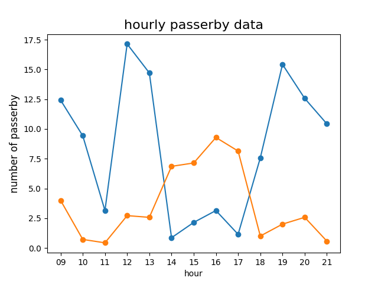

# 생활 데이터 가공하기

Review code and trouble shootings

## 정리한 데이터를 꺾은선 그래프로 표현하기

마지막으로 데이터를 그래프로 출력하는 코드가 추가됨. 특별한 건 없다.

[2-1-08.py](2-1-08.py)

## 생각해 보기

은재가 수집한 데이터에서 오전 9시부터 오후 9시까지의 유동 인구 중 40세 이상 행인의 수와 40세 미만
행인의 수를 한꺼번에 그래프로 출력하는 프로그램으로 확장해 보자.

### 40세 이상?

다시 잘 보면 데이터는 분명 30대 이하 행인의 수이다. 그러면 30대는 30~39세를 뜻하고 30대 이하는 0~39세를 얘기하는 것이다.
그러므로 40세 (40대 아님 주의) 이상이면 전체 행인 수에서 30대 이하 행인 수를 빼면 40세 이상 행인의 수가 나올 것이다.

### 수정해야 할 부분

생각해 보기의 요구사항은 크게 두 가지로

- 오전 9시 부터 오후 9시 까지의 범위
- 40세 이상과 40세 미만 행인 수를 한꺼번에 그래프로 출력

이다.

[2-1-08-example.py](2-1-08-example.py)

오전 9시 부터 오후 9시의 경우는 hour_title array를 실제 '09' ~ '21'로 해주면 된다.
왜냐하면 for문은 이 hour_title의 갯수만큼 돌게 enumrate 함수를 사용했기 떄문이다.
단, 이건 내가 refactoring 한 코드의 경우 동작하기 때문에 기존 책의 예제에서 수정하려면 Range (0, 13)로 범위도 바꿔야 할 것이다.

``` python
hour_title = ['09', '10', '11', '12', '13', '14','15', '16', '17', '18', '19', '20','21']
```

30대 이하는 기존 코드에서 구할 수 있으므로
40세 이상에 대한 변수와 계산을 별도로 해준다.
전체 행인수에서 30대 이하를 빼면 40세 이상의 행인 수가 된다.

``` python

# 시간대별로 주간 평균값 구하기
avgh_under30 = []
avgh_over40 = []
for hour_index, hour_value in enumerate(hour_title) :                          # 00~21시간만큼 반복
    under30_day_sum = over40_day_sum = 0                                  # 시간대별 합을 구하기 위해 0으로 초기화
    # 각 시간대 총합
    for day_index, day_value in enumerate(day_title) :                      # 일주일, 즉 7번 반복하기
        under30_day_sum += int(a[day_index][hour_index]['ynum'])  # 요일별 + 시간대별 행인수 누적하기
        over40_day_sum += int(a[day_index][hour_index]['num']) - int(a[day_index][hour_index]['ynum'])  # 전체 행인수에서 30대 이하를 빼면? 40세 이상 행인수

    avgh_under30.append(under30_day_sum/7)                      # 시간대 30대 이하 행인수 평균 구하기
    avgh_over40.append(over40_day_sum/7)                      # 시간대 40세 이상 행인수 평균 구하기
```

그래프 출력 역시 40세 이상을 더 추가해 주면 그래프가 함께 출력된다.

``` python
plt.scatter(hour_title, avgh_over40)                       # 꺽은선 그래프 그리기
plt.plot(hour_title, avgh_over40)
```

30대 이하와 40세 이상이 함께 출력된 그래프 이미지

