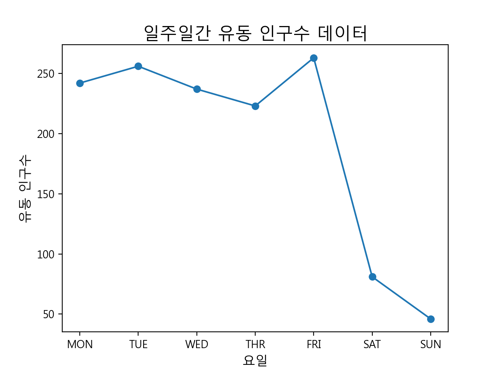

# 생활 데이터 표현하기

Review code and trouble shootings

## [Step 1] 유동 인구 데이터를 컴퓨터로 저장한 후 출력하기

제목은 거창하지만 array 출력하는게 전부인 코드, 컴퓨터로 저장한다는 개념이 array의 값들을 하드코딩하는 것이다.

[2-1-01.py](2-1-01.py)

<details>
<summary>Code</summary>
<p>

``` python
# 은재가 조사한 일주일간 유동 인구 데이터 (월요일~일요일)
a = [242, 256, 237, 223, 263, 81, 46] # 리스트에 유동 인구 데이터 초기화
print('A = ', a) # 출력하기
```

</p>
</details>

## [Step 2] 유동 인구수 데이터의 총합과 평균 구하기

Step 1에 이어서 유동인구 데이터의 합을 구하고 평균을 구한다. 여기까지는 프로그래밍을 모르고 수학 정도만 알고 있어도 이해가 가능하다.

[2-1-02.py](2-1-02.py)

<details>
<summary>Origin code</summary>
<p>

``` python
# 은재가 조사한 일주일 간 유동인구 데이터 (월요일 ~ 일요일)
a = [242, 256, 237, 223, 263, 81, 46]

# -----------------------------------------------------------
# 유동 인구 데이터의 총합과 평균 구하기

n = len(a)                          # 수열 a항 개수 구하기: 7개
my_sum = 0                          # 합을 저장할 변수를 0으로 초기화 
my_avg = 0                          # 평균을 저장할 변수를 0으로 초기화
i = 0                               # 수열 항의 인덱스, 파이썬은 첫번째 수열 항의 인덱스는  0부터 시작함.

for i in range (0, n) :             # 인덱스 값은 0부터 시작하여 n번 반복하기
    my_sum = my_sum + a[i]          # 총합 구하기 

my_avg = my_sum/n                   # 평균 구하기


print("Total Sum : ", my_sum)       # 총합 출력하기
print("Total Average : ", my_avg)   # 평균 출력하기
```

</p>
</details>

python에는 sum() 함수를 쓸 수 있으므로 sum() 함수를 호출하여 간단하게 합을 구할 수 있다. 책에서는 for문의 동작 원리를 설명하려고 했기 때문에 for 문을 사용했다.

[2-1-02-sum.py](2-1-02-sum.py)

<details>
<summary>Refactoring code</summary>
<p>

``` python
# 은재가 조사한 일주일 간 유동인구 데이터 (월요일 ~ 일요일)
a = [242, 256, 237, 223, 263, 81, 46]

# -----------------------------------------------------------
# 유동 인구 데이터의 총합과 평균 구하기

n = len(a)                          # 수열 a항 개수 구하기: 7개
my_sum = sum(a)                          # 합을 저장할 변수를 sum 함수를 호출하여 저장
my_avg = my_sum/n                   # 평균 구하기

print("Total Sum : ", my_sum)       # 총합 출력하기
print("Total Average : ", my_avg)   # 평균 출력하기
```

</p>
</details>

## [Step 3] 주어진 수열 데이터를 꺾은선 그래프로 표현하기

matplotlib라는 훌륭한 패키지를 이용해서 데이터 시각화를 할 수 있다.


[2-1-03.py](2-1-03.py)

<details>
<summary>Origin code</summary>
<p>

``` python
# 주어진 수열 데이터를 꺾은선 그래프로 표현하기

# 은재가 조사한 일주일 간 유동인구 데이터 (월요일 ~ 일요일)
a = [242, 256, 237, 223, 263, 81, 46]

# ----------------------------------------------------------------

# 그래프를 그리기 위한 외부 모듈 선언
import matplotlib.pyplot as plt
from matplotlib import font_manager, rc

#한글을 출력하기 위한 폰트 로딩
font_name = font_manager.FontProperties(fname="c:\Windows\Fonts\malgun.ttf").get_name()
rc('font', family=font_name)                                    # 그래프 제목에 한글 표시하기

x_data = ['MON', 'TUE', 'WED', 'THR', 'FRI', 'SAT', 'SUN']       # x축에 표시할 제목 리스트에 저장 

# 그래프의 제목 붙이기 
plt.title("일주일간 유동 인구수 데이터", fontsize = 16)            # 큰 제목 
plt.xlabel("요일", fontsize=12)                                  # x축 제목
plt.ylabel("유동 인구수", fontsize=12)                           # y축 제목

plt.scatter(x_data, a)                                           # 꺽은선 그래프 그리기
plt.plot(x_data, a)
plt.show()
```

</p>
</details>

맥북에서는 아마 맑은 고딕이 설치가 안되어 있을 수도 있고, 설치되어 있다고 하더라도 windows 기준으로 작성된 코드에서는 절대 맑은 고딕을 불러오기는 커녕 오류만 나게 된다.

다행히 다운로드 받은 소스코드에는 malgun.ttf 파일이 들어 있으므로 코드에 써 있는 malgun.ttf 파일 경로를 다음과 같이 상대 경로로 바꿔준다.

``` python
font_name = font_manager.FontProperties(fname="malgun.ttf").get_name()
```

그런데 이렇게 해도 폰트를 불러올 수가 없을 수도 있는데 이 경우는 맥북에 python 환경을 처음 설치해서 쓰는 경우일 것이다.

matplotlib의 font cache가 새로 설치했거나 혹은 코드에서 읽어들인 malgun.ttf 파일의 목록을 refresh하지 않았기 때문에 발생하는 것으로 구글 조금 검색해 보면 답을 찾을 수 있다.

python 코드로 입력하면 font_manager._rebuild()를 실행시켜 font cache를 refresh 해 준다.

``` python
font_manager._rebuild()

```

그러면 맥북에서도 아래 이미지 처럼 그래프를 볼 수 있다.



[2-1-03-iOS.py](2-1-03-iOS.py)

<details>
<summary>iOS(Macbook) code</summary>
<p>

``` python
# 주어진 수열 데이터를 꺾은선 그래프로 표현하기

# 은재가 조사한 일주일 간 유동인구 데이터 (월요일 ~ 일요일)
a = [242, 256, 237, 223, 263, 81, 46]

# ----------------------------------------------------------------

# 그래프를 그리기 위한 외부 모듈 선언
import matplotlib.pyplot as plt
from matplotlib import font_manager, rc

#한글을 출력하기 위한 폰트 로딩
font_name = font_manager.FontProperties(fname="malgun.ttf").get_name()
rc('font', family=font_name)                                    # 그래프 제목에 한글 표시하기
font_manager._rebuild()

x_data = ['MON', 'TUE', 'WED', 'THR', 'FRI', 'SAT', 'SUN']       # x축에 표시할 제목 리스트에 저장 

# 그래프의 제목 붙이기 
plt.title("일주일간 유동 인구수 데이터", fontsize = 16)            # 큰 제목 
plt.xlabel("요일", fontsize=12)                                  # x축 제목
plt.ylabel("유동 인구수", fontsize=12)                           # y축 제목

plt.scatter(x_data, a)                                           # 꺽은선 그래프 그리기
plt.plot(x_data, a)
plt.show()
```

</p>
</details>