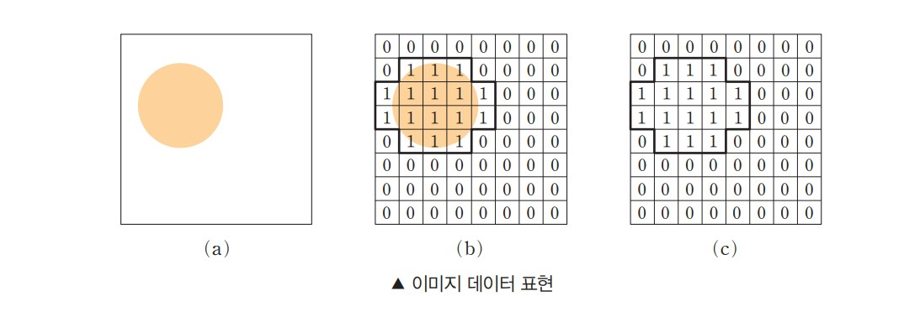
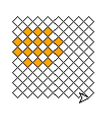

# 이미지 데이터 표현하기

Review code

## 생각해 보기



> 그림 (c)로 표현된 정보로부터 해당 픽셀에 다른 수치를 넣어 색을 다르게 표현해 보자. 원래의 이미지와 동일한 모양인가? 만약 같지 않다면, 원래의 이미지와 조금 더 비슷하게 표현하려면 어떻게 해야 할지 생각해 보자.

이걸 어떻게 생각해야 할지 많이 당황스럽다. 왜냐하면 색을 다르게 표현한다고 해서 모양이 다르지는 않기 때문이다. 그런데 질문이 모양이 다를 것이기 때문에 원래 이미지와 비슷하게 표현하려면 어떻게 해야 할지 생각해 보라고 하는데...

이건 그냥 "동일한 모양임, 더 이상 생각 ㄴㄴ"가 답인 것 같다.

## 2차원 배열의 정보를 화면으로 출력하기

[2-2-01.py](2-2-01.py)

역시 하드코딩으로 데이터를 준비하고 putPixel 함수를 통해 다각형을 그리는 걸 8x8 해서 64회 진행한다.

### turtle 코드 분석

turtle는 그래픽을 그릴 수 있는 모듈이다. 예제코드에 쓰인 파라미터의 값들을 분석해 본다.

``` python
turtle.goto(x*pSize,(-1)*y*pSize)          # 주어진 좌표로 이동
```

주석은 주어진 좌표로 이동한다고만 되어 있는데 어떻게 이동하는지 분석한다.

x는 0에서 7까지, y도 0에서 7까지의 값으로 들어온다. 그 값을 pSize로 곱하면 0, 10, 20, 30, ... 의 값이 되게 된다. y의 경우 -1을 곱하는데 아래쪽 방향으로 이동 시키기 위해서 -1을 곱하는 것이다. 쉽게 2차원 평면좌표를 생각해 보면 된다.

``` python
turtle.setheading(45)                      # 시작 각도를 45도로 지정
```

이걸 이해하려면 그 다음 코드까지 함께 이해해야 한다.

``` python
turtle.setheading(45)                      # 시작 각도를 45도로 지정
turtle.circle(pSize/2, steps = 4)          # 정사각형 픽셀 도출하기
```

만약 turtle.setheading(45) 코드 없이 그리게 되면 아래 그림처럼 나오게 된다.



사각형을 그리는데 45도로 기울지 않았으므로 마름모 형태로 나오게 된다.

또 turtle.circle는 원을 그리는 함수인데 사각형이 나오는 이유는 두번째 파라미터인 steps = 4에 있다. 이건 원을 그리는 횟수를 지정하는 것으로 4로 지정하면 네번에 그릴 수 있는 원이라는 뜻이고 그게 사각형이 된다.

이건 구글 검색해 봐도 잘 안나오는데, 이런걸 어떻게 발견해서 적용했는지 대단하다는 생각이 든다.

보통은 선을 한번 그리고 각도를 90도씩 꺾는 함수를 네번 반복해서 사각형을 그리는데, 이 방법은 조금 신박한 것 같다.

## 행렬의 성분값을 다른 색으로 바꾸어 표현하기

[2-2-02.py](2-2-02.py)

첫번째 예제에서 색 값만 "orange"에서 "blue"로 변경한게 전부이다.