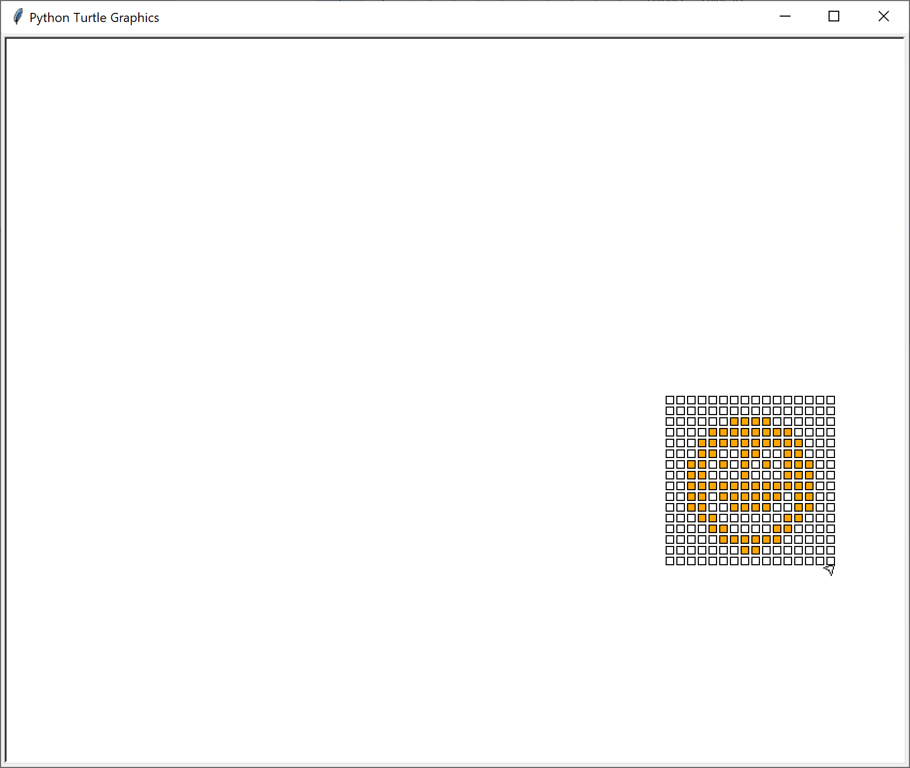

# 이미지 데이터 다루기

Review code

## 2-1 이미지 데이터를 겹쳐서 표현하기

### 16×16 2차원 배열의 정보를 화면에 나타내기

[2-2-03.py](2-2-03.py)

마찬가지로 하드코딩으로 데이터를 준비하고 putPixel 함수를 통해 그리는 건 같다.

이전 예제와 다른 점은 해상도를 16x16으로 높였다는 점이고 (그만큼 행렬 만드는 하드 코딩의 양은 끔찍) 그걸 원과 스마일을 두 번 그린다는 점이다.

아래는 그리는 중에 찍은 스크린샷


### 행렬의 합을 이용해서 두 이미지를 결합하기

[2-2-04.py](2-2-04.py)

2-2-03 예제 코드에서 행렬의 합을 구하고 합에 해당하는 값을 if 문으로 구분해 합쳐서 그린다는 개념이다.

즉, 0과 1로 구성된 행렬과 0과 2로 구성된 행렬의 합은 0, 1, 2, 3으로 구성된 행렬로 표현된다는 뜻이다.

여기서 if문 해석을 조금 해보자면

``` python
if (addImage[j][i] > 1) :                     # addImage 행렬의 성분값이 2 이상이면 빨간색으로 출력하기
    putPixel(i,j,pixelSize, "red")
elif (addImage[j][i] > 0) :                   # addImage 행렬의 성분값이 1이면 오렌지색으로 출력하기
    putPixel(i,j,pixelSize, "orange")        
else :                                        # ddImage 행렬의 성분값이 0 이하이면 흰색으로 출력하기
    putPixel(i,j,pixelSize, "white")         
```

코드를 보고 2, 1, 0이 구분이 쉽지 않다. 왜냐하면 비교하는 대상의 값은 1과 0 뿐이기 때문이다.

물론 주석을 통해 if문의 논리 값을 설명하긴 하지만 코드만으로는 충분하지 않다. 그래서 아래와 같이 바꿔보면 괜찮을 것 같다.

``` python
if (addImage[j][i] >= 2) :                     # addImage 행렬의 성분값이 2 이상이면 빨간색으로 출력하기
    putPixel(i,j,pixelSize, "red")
elif (addImage[j][i] == 1) :                   # addImage 행렬의 성분값이 1이면 오렌지색으로 출력하기
    putPixel(i,j,pixelSize, "orange")        
else :                                        # ddImage 행렬의 성분값이 0 이하이면 흰색으로 출력하기
    putPixel(i,j,pixelSize, "white")         
```

수정한 코드는 아래와 같고

[2-2-04_fix_if_condition.py](2-2-04_fix_if_condition.py)

실행결과 역시 크게 다르지 않다.


### 행렬의 차이를 이용해서 두 이미지 표현하기

[2-2-05.py](2-2-05.py)

이번엔 행렬의 차이를 이용한 출력이고 크게 어려워 보이는 건 없다.

다만 putPixel 함수에서 하나만 그리면 되는데 굳이 i+20을 해서 오른쪽에 그렸는지는 이해할 수 없다.



## 2-2 여러 색을 갖는 이미지 데이터 표현하기

[2-2-06.py](2-2-06.py)

준비된 bmp 이미지에서 색상을 추출하는 방식인데 python을 잘 모르면 이해하기 어려운 부분을 설명해 본다.

우선 RGB 값을 추출하는 원래 코드는 아래와 같다.

``` python
# pix array에서 각각 R(0), G(1), B(1) 성분 값 외에는 0으로 만들어서
# 원본 이미지에서 R, G, B에 해당하는 배열 만들기 
pix_R = pix.copy()
pix_R[:, :, (1,2)] = 0
pix_G = pix.copy()
pix_G[:, :, (0,2)] = 0
pix_B = pix.copy()
pix_B[:, :, (0,1)] = 0
```

pix_R의 값이 원래 이미지에서 copy해온 값인건 알겠는데 그 다음 코드가 보기가 어렵다.

설명을 추가하자면 pix_R의 경우는 3차원 배열이라고 보면 되는데 각 인덱스 별로 표현하는 건 다음과 같다

- 0: width
- 1: height
- 2: RGB

그래서 첫번째, 두번째가 콜론(:) 으로 되어 있는 건 with, height의 값을 모두 사용한다는 뜻이다.

두 인덱스에 걸쳐 모두 사용한다면 아래와 같은 코드로 변경도 가능하다.

``` python
pix_R[..., (1,2)] = 0
```

마지막의 인덱스의 (1,2) 값은 해당 인덱스만 0으로 설정하겠다는 뜻이니까 첫번째 인덱스인 0 즉 R에 해당하는 값만 0으로 설정되지 않고 G인 1과 B인 2의 값이 0으로 설정된다.

그래서 최종적으로는 width, height는 그대로 두고 R 값만 살려서 최종 이미지의 array를 만들어내는 것이다.

좀 알아보기 쉽게 리팩토링을 진행했는데

- RGB 배열에서 각 R, B, B 값을 어떻게 추출하는지와
- pix_R에 0을 세팅하는게 어떤 의미인지

에 대해 적어 봤다.

이렇게 적으면 배열에서 쓰는 콜론(:)의 의미를 더 잘 이해할 수 있다.

``` python
# pix array에서 각각 R(0), G(1), B(2) 성분 값 외에는 0으로 만들어서
# 원본 이미지에서 R, G, B에 해당하는 배열 만들기
RGB = [0,1,2]
R = RGB[1:] # [1,2]
G = [RGB[0],RGB[2]]   # [0,2]
B = RGB[:2] # [0,1]

pix_R = pix.copy()
pix_R[..., R] = 0  # width, height, RGB
pix_G = pix.copy()
pix_G[..., G] = 0
pix_B = pix.copy()
pix_B[..., B] = 0
```

[2-2-06_fix_RGB.py](2-2-06_fix_RGB.py)

마지막으로 plt.subplot() 함수의 파라미터로 들어가는 값에 대한 설명이다.

``` python
plt.subplot(141)  # row=1, col=4, index=1
```

주석에도 설명되어 있듯이 숫자 141이 뜻하는 게 각각 row, column, index의 뜻이다.

그림을 그릴 때 table을 그린다고 생각하면 1개의 row가 있고 4개의 column이 있다고 했을 때 첫번째 column에 배치하겠다는 것이 141의 의미이다.

이후 142, 143, 144도 마찬가지로 해석해 보면 왜 그림이 4개가 차례대로 배치됐는지 이해할 수 있다.

최종 결과는 수정하기 전 코드와 다르지 않다.

