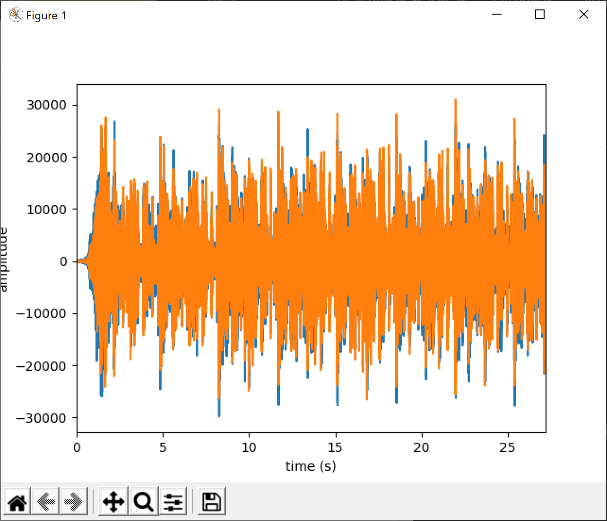

# 소리 데이터 표현하기

Review code

## 소리 데이터의 처리에 필요한 외부 모듈 설정하기

[2-3-01.py](2-3-01.py)

필요한 모듈 준비 numpy와 matplotlib.pyplot은 계속 사용해왔던 것이라 생소하지 않다.

- scipy.io.wavfile
  - 책에도 간단히 설명이 있지만 실제 doc 파일을 보는게 나을 수 있다.
  - [https://docs.scipy.org/doc/scipy/reference/generated/scipy.io.wavfile.read.html](https://docs.scipy.org/doc/scipy/reference/generated/scipy.io.wavfile.read.html)
- sounddevice
  - wav 파일 재생을 위한 모듈

## 그래프로 표현할 소리 파일 읽어오기

책에 설명이 너무 잘 되어 있다.

sample rate 값과 실제 데이터 사이의 관계만 잘 확인하면 될 듯

``` python
times = np.arange(len(v_data))/float(v_samplerate)     # x축 시간 정보를 구하기
```

## 그래프로 표현할 소리 파일 확인하기

역시 책에 설명이 잘 되어 있다.

## 생각해 보기

> mp3 파일 등 다른 형식의 소리 파일들을 사용할 때에도 일단 wav 형식으로 변환한 후 원하는 작업을 하
는 경우가 많다. mp3 파일을 wav 파일로 변환하는 외부 모듈을 사용하여 [Step 1]~[Step 3] 프로그램
에서 표현한 것처럼 mp3로 압축된 소리 데이터를 그래프로 나타내어 보자.

검색해 보면 mp3를 wav 파일로 변환하는 훌륭한 페이지를 찾을 수 있다.

[https://pythonbasics.org/convert-mp3-to-wav/](https://pythonbasics.org/convert-mp3-to-wav/)

이걸 사용하려면 pydub을 설치해야 한다.

``` shell
pip install pydub
```

그리고 ffmpeg를 설치해야 하는데 각 os에 맞는 설치 방법에 따라 설치해 준다.

[https://ffmpeg.org/download.html](https://ffmpeg.org/download.html)

Windows 환경에서 설치하고 설정하는 방법은 아래 페이지에서 확인해 보면 된다.

[http://blog.gregzaal.com/how-to-install-ffmpeg-on-windows/](http://blog.gregzaal.com/how-to-install-ffmpeg-on-windows/)

[2-3-01_mp3_to_wav.py](2-3-01_mp3_to_wav.py)

이 파일에서 추가된 건 mp3 파일에서 wav 파일로 변환한 코드를 추가한 것이다.

``` python
from os import path
from pydub import AudioSegment # mp3 to wav

mp3Sound = AudioSegment.from_mp3("file_example_MP3_700KB.mp3")
mp3Sound.export("file_example_MP3_700KB.wav", format="wav")

# 작업 폴더에 저장된 ‘file_example_MP3_700KB.wav’ 파일 읽기
v_samplerate, v_data = scipy.io.wavfile.read("file_example_MP3_700KB.wav")
```

이후 코드는 똑같고 결과는 아래와 같다. vData 값이 길기 때문에 5개 까지만 넣었다.

``` shell
sampling rate:  32000
time :  27.1934375
vData :  [[  66   22]
 [  83   30]
 [  89   30]
 [  98   43]
 [ 108   38]
 ...
```

