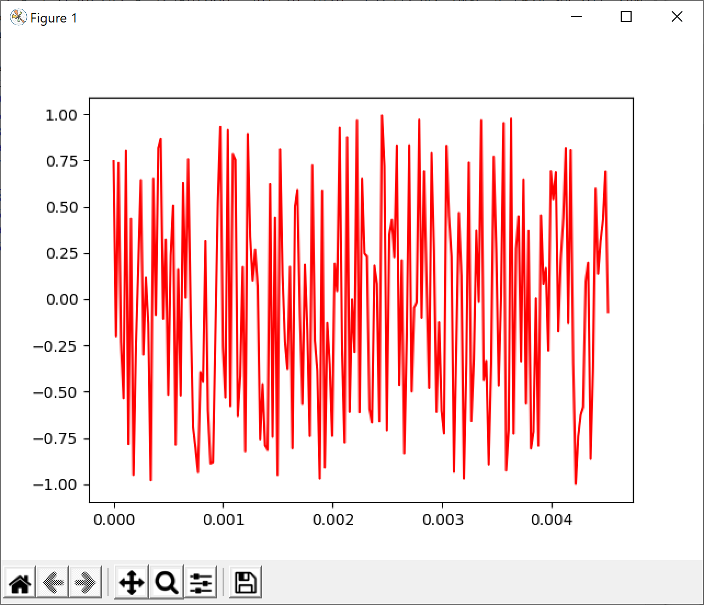
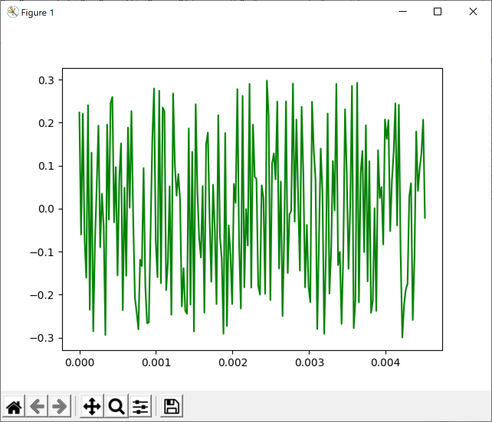

# 소리 데이터 다루기

Review code

## 소리 데이터에 필요한 외부 모듈과 환경 변수 설정하기

[2-3-02.py](2-3-02.py)

필요한 모듈 준비

- numpy
- matplotlib.pyplot
- scipy.io.wavfile
- os

## 생성할 소리 데이터의 속성과 사인함수로 생성할 데이터를 저장하기 위한 환경 변수 설정하기

array를 생성할 건데 44.1KHz 주기로 만든다.

1초에 44100개의 데이터를 표현해야 하니까 0 부터 1 까지 44100개의 값을 순차적으로 갖는 array를 생성하는 것이다.

원래 코드는 아래와 같고, 설명을 위해 과도하게 친절한 주석과 의미 없는 변수 담기등으로 코드가 길어진 경향이 있다.

``` python
# sampling rate
Fs = 44100.0                                   # 정보 샘플링 주기, 1초에 44100개의 샘플링, 단위는 Hz(주파수)            

# 1초 데이터 생성을 위한 환경 변수 설정
tlen = 1                                       # 1초
Ts = 1/Fs                                      # 샘플링 사이의 간격(시간)
t = np.arange(0, tlen, Ts)                     # 소리 데이터를 생성할 시간 성분으로 구성된 배열로
                                               # [0, 1] 사이를 TimeStamp의 간격으로 분할하여
                                               # Fs 개의 데이터를 담을 수 있는 배열
```

그런데 np.arange가 뭘 하는 코드인지 안다면 직관적으로 아래와 같이 한줄로 코딩이 가능하다.

``` python
t = np.arange(0, 1, 1/44100.0) # 0 부터 1까지 1/44100.0 step을 가지는 array 생성, 데이터 갯수는 44100개
```

## 사인함수를 이용하여 임의의 소리 데이터 만들기

책에 변환 과정에 대한 설명과 array 값의 변화 그림이 잘 나와있다.

``` python
# 시그널 생성하기
sin_freq = 440 # 사인 곡선의 주파수
src = 2 * np.pi * sin_freq * t # t 배열의 각 성분값에 사인함수의 주기를 라디안 단위로 변환한
# src 배열을 준비
signal = np.sin(src) # timestamp를 각으로 변환한 src 배열에 맞게 사인함수 데이터를 변환
```

## 생성한 소리 데이터를 wav 형식의 파일로 저장하기

[2-3-03.py](2-3-03.py)

역시 책에도 설명이 잘 되어 있지만 코드 설명을 덧붙이면

signal은 sin 주기에 맞춰 440 샘플링된 배열이다.

np.abs는 절대값을 구하는 것이고, np.max를 적용하면 거의 1에 가까운 값을 얻게 된다.

이 값을 signal로 나눠주면 역시 거의 -1 ~ 1에 가까운 값이 나오고 이걸 32767이라는 뜬금없는 숫자를 곱하는데 이건 2^16의 절반 즉 -32767 ~ 32767 사이의 값을 얻기 위함이며 이건 int16 type의 범위이기도 하다.

즉 16bit로 된 데이터 값을 44100 주파수로 맞춰 기록을 하면 16bit 사운드 파일이 만들어 진다.

실제로 snd_signal.wav 파일을 들어보면 고주파음이 난다. (TV 정규방송이 종료되는 새벽 시간에 송출되는 소리와 거의 같다.)

``` python
# sin 함수로 생성한 음성 데이터를 wav 형식의 파일로 저장
scaled = np.int16(signal/np.max(np.abs(signal)) * 32767)
write('snd_signal.wav', 44100, scaled)
```

### 생각해 보기

> 사인함수로 데이터를 생성할 때 사인파의 주파수를 440Hz로 생성했다. 이 주파수를 조정하면서 주파수
에 따라 소리가 어떻게 달라지는지 확인해 보자.

직접 변수를 수정해 보면서 저장되는 파일을 재생해 보면 된다.

sin_freq 값을 880, 220 등으로 변환해 보면 숫자가 높을 수록 고주파수, 낮으면 저주파수 소리가 난다.

실제 생성한 파일 링크를 추가.

[snd_signal_220.wav](snd_signal_220.wav)

[snd_signal_880.wav](snd_signal_880.wav)

## 잡음 데이터 만들기

[2-3-04.py](2-3-04.py)

np.random.uniform() 함수는 균등분포를 만들어준다. 간단하게 얘기해 보면 어떤 구간 내에 발생하는 값들에 대해 난수 발생 조건에 따라 특정 구간에 많은 값 혹은 적은 값들이 나오는 걸 피하기 위해 골고루 분산 시켜 난수를 발생시킨다는 개념으로 이해하면 된다.

책에 이 내용을 언급하는 부분이 있어서 참고를 반드시 하고 코드를 봐야 한다.

저작권 문제로 책 내용을 모두 얘기할 수는 없고, 핵심 적인 키워드만 나열해 보면

- 연속확률분포에 대한 개념
- 균등 분포(Uniform Distribution) 개념
- 혹은 [연속 균등 분포](https://en.wikipedia.org/wiki/Continuous_uniform_distribution)(Continious Uniform Distribution)

을 잠깐 보면 좋다.

코드는 대체로 여태까지 사용했던 방식의 재사용이라 크게 문제될 건 없다.

다만 그래프를 그리는 과정에서 아래 코드가 나오는데, `y축의 데이터 구간을 –1과 1 사이로 지정` 이 주석이 코드 설명이라 왜 이 코드가 들어갔는지에 대해 추가로 적어 본다.

``` python
# 데이터의 시각화: 원 데이터의 볼륨을 낮춘 scaled_noise 데이터를 그래프로 표현
plt.plot(t[0:x_range], scaled_noise[0:x_range], color = 'green')
plt.ylim(-1, 1) # y축의 데이터 구간을 –1과 1 사이로 지정
plt.show( )
```

이건 scaled_noise값을 만든 이유를 이해하면 알 수 있는데 원래 noise를 생성한 값의 범위는 -1 ~ 1 이다. 그런데 중간에 30%를 낮춘 scaled_noise를 만들었기 때문에 `plt.ylim(-1, 1)` 이 코드를 추가해서 y축의 범위를 정해주지 않으면 -0.3 ~ 0.3의 범위이고 보이는 크기가 같은 원래 noise 그래프와 큰 차이를 느낄 수 없기 때문이다.

실제 `plt.ylim(-1, 1)` 코드를 지우고 두 그래프를 비교해 보면 y축의 값의 범위를 보기 전까지 그래프 자체의 차이점을 느낄 수 없다.

noise 그래프


plt.ylim(-1, 1)를 적용하지 않은 noise_scaled 그래프
