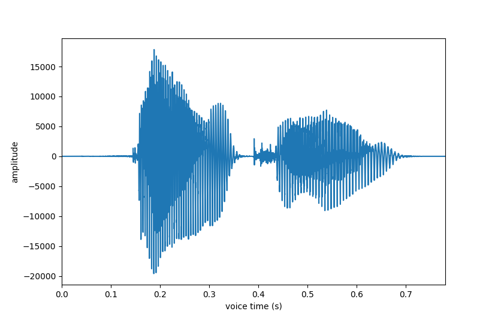

# 소리 데이터 가공하기

Review code

## 3-1. 사인 파형의 소리와 잡음 소리 합성하기

[2-3-05.py](2-3-05.py)

### 생활 속의 소리 합성하기

sin 파 값과 균등 분포 값을 생성해서 소리데이터를 만드는 것 까지 진행했으므로 그 둘을 합치면 합친 소리가 나는 코드를 추가한 것이다.

소리를 글로 표현해 보자면 다음 과 같다.

- sin 파 값 소리: TV 정규 프로그램 종료나 시작되기 전 송출되는 소리, 삐~~~~~~
- 균등 분포 값 소리: TV 채널에 송출되는 신호가 없어서 나오는 소리, 치이익~치이익~

두 소리 데이터를 산술 적으로 더하면 소리가 합성된다는 표현을 썼지만 코드로 표현해 보자면 두 array의 값들을 더한게 전부이다.

그 외에 특별히 어려운 부분은 없다.

### 소리 듣기

[2-3-06.py](2-3-06.py)

생성한 wav 파일을 python 코드를 실행시켜 소리를 듣는건데 OS에 wav 연결 프로그램으로 설정되어 있는 프로그램이 실행될 수 있게 start 명령을 쓴 것이다.

문제가 하나 있는데 wav 파일 세 개를 동시에 열면 차례대로 실행되서 소리가 들리는게 아니라 동시에 열리고 마지막에 실행한 `snd_noise.wav` 파일의 소리만 들리기 때문에 아래와 같은 코드를 그대로 실행시키면 모든 wav 파일의 소리를 제대로 들을 수 없다. 그래서 코드를 지우거나 주석 처리 해서 한 줄만 실행시켜서 들어보는게 좋다.

``` python
# [Step 1]에서 만든 소리 듣기

import os                   # wav 파일을 시스템 명령어로 재생하기 위한 모듈 

os.system("start snd_signal.wav")
os.system("start noise_signal.wav")
os.system("start snd_noise.wav")
```

## 3-2. 음성 카드 만들기

### 나만의 소리 파일의 데이터와 샘플링 주파수 확인하기

[2-3-07.py](2-3-07.py)

- [thank_you.wav](thank_you.wav) 파일은 1채널 모노 0.7초 22500Hz
- [Invisible_Beauty.wav](Invisible_Beauty.wav) 파일은 2채널 스테레오 360초 44100Hz

### 나만의 소리 파일의 데이터와 샘플링 주파수를 그래프로 출력하기

[2-3-08.py](2-3-08.py)

위에서 확인한 소리 파일 데이터를 그래프로 출력한 것이다. 별 의미는 없음.
Thank you | Invisible beauty
:-------------------------:|:-------------------------:
 | 

### 나만의 소리 파일의 샘플링 주파수와 채널 타입 바꾸기

[2-3-09.py](2-3-09.py)

코드 분석

#### 채널 변경

``` python
# stereo channel -> mono channel
if (len(v_data.shape) > 1) : 
   v_data = np.array(v_data[:,0])
if (len(b_data.shape) > 1) : 
   b_data = np.array(b_data[:,0])
```

위와 같이 코드가 구현되어 있는데 v_data[:, 0] 코드는 파이썬을 자주 써도 어떻게 변하는지 잘 머리속에 그려지지 않는다.

만약 v_data.shape이 (10, 2) 라면 10x2의 matrix 형태라고 이해하면 된다.

v_data.shape이 (10, )라고만 되어 있으면 10x1 그러니까 보통의 array 형태이다.

실제 출력해 보면 (17230,)로 찍히므로 mono 채널, 즉 1채널만 있는 데이터이다.

그래서 v_data.shape는 1이므로 if문은 실행되지 않고 b_data.shape는 2이므로 실행된다.

b_data[:,0]은 모든 데이터를 가져오는 의미의 :을 사용한 것이고, 0은 1d 공간 즉 첫번째 채널의 데이터만 가져오겠다는 뜻이다.

만약 b_data[:,1]로 했다면 두번째 채널의 데이터만 가져온다는 뜻이 되고 실제로 수정해서 실행해 보면 재생되는 소리의 차이가 크게 느껴지지 않는다.

그런데 이건 잠재적인 문제를 가지고 있는데, stereo 채널이 다행이 두 채널 모두 데이터가 일관성 있게 들어 있다면 상관 없는데 녹음 된 환경에 따라 1채널과 2채널의 데이터의 변화가 크다면 문제가 생길 수 있다.

보통 좌, 우로 구분해서 소리 데이터를 만들어주는데 한쪽 채널에 쏠려서 데이터를 만들었다면 소리 차이가 날 수 밖에 없다.

극단적으로 1채널에 소리 데이터가 0%가 들어 있고 2채널이 100%가 들어 있다면 위의 코드를 실행했을 때 아무 소리가 안나게 된다.

그래서 stereo를 mono로 바꾸려면 두 채널의 데이터 값을 합하고 2로 나눠서 평균 값을 구한 걸 다시 하나의 채널에 소리가 나게 바꿔야 한다.

``` python
if (len(b_data.shape) > 1) :
   channel1 = np.array(b_data[:,0])
   channel2 = np.array(b_data[:,1])
   b_data = channel1 / 2 + channel2 / 2
```

이렇게 하면 한 채널의 데이터가 100% 들어있고 다른 채널이 0%가 있다고 하더라도 평균 50%의 값으로 한 채널로 합쳐지기 때문에 소리의 불균형 문제는 해소될 것이다.

#### 샘플링 주기 낮추기

여기도 :을 두개 쓰는 생소한 코드가 있다.

``` python
v_data = np.array(v_data[0:len(v_data):diffRate])
```

array slice 부분을 찾아보면 바로 이해가 된다.

https://www.w3schools.com/python/numpy_array_slicing.asp

그래서 코드의 이해는 diffrate 비율대로 데이터를 진짜 샘플링 해서 다시 만들어 주는 코드라고 보면 된다. 이렇게 하면 두 wav 파일의 samplerate가 달라도 같게 만들 수 있다.

### 나만의 소리 데이터를 배경 음악과 합성하여 듣기

samplerate가 44100이 뜻하는 의미를 다시 이해해 보면 1 초에 진동하는 주파소의 갯수가 44100개라는 뜻이기도 하다 그러므로 아래의 코드는 samplerate의 10배 즉 10초가 되는 부분의 데이터를 합쳐서 하나의 데이터로 만드는 작업이라고 이해할 수 있다.

``` python
mix_data = v_data + b_data[sr * 10:len(v_data) + sr * 10]
```
