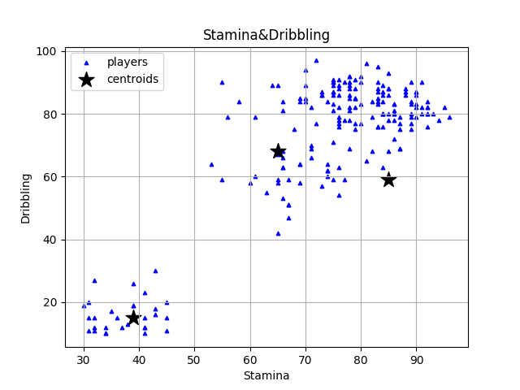

# 내가 만약 축구팀 감독이라면

Review code

## 학습하기

### 비슷한 특성의 데이터끼리 묶기

K-Means로 clustering 진행

- 군집 내 응집도 최대화: 같은 군집 내 데이터들 간의 거리를 최소화하는 것이다.
- 군집 간 분리도 최대화: 다른 군집 간 거리를 최대화하는 것이다.

### K-평균(K-Means) 군집화 알고리즘의 동작 과정 알아보기

- 표본공간에 K개의 중심을 무작위로 생성하기
- 각 표본을 가장 가까운 중심(centroid)에 할당하기
- 각 군집의 중심을 새롭게 계산하기

### 프로그램 작성하기

#### 데이터 불러오기

[3-1-11.py](3-1-11.py)

``` python
# 데이터 불러오기

import pandas as pd

fifa2019 = pd.read_csv('fifa2019.csv')

df = pd.DataFrame.copy(fifa2019.sort_values(by = 'Overall', ascending = False).head(200))

test_features=['Name','Stamina','Dribbling','ShortPassing','Penalties']

test_df= pd.DataFrame(df, columns = test_features)

print(test_df.head(5))

```

어려운 부분은 없다. 코드를 그냥 읽어보면 뭘 하려고 하는지 이해가 되기 때문이다. 어쨌든 중요하다고 생각하는 데이터를 가져와서 확인해 보는 작업이다.

#### 학습 데이터 준비하기

[3-1-12.py](3-1-12.py)

``` python
# 체력(Stamina) & 드리블(Dribbling)
import numpy as np
XY = np.array(test_df)
X = XY[:,1:3]
```

이 부분도 역시 numpy의 array로 바꾸면 2차원 배열 형태가 되는데 거기서 stamina와 dribbling 점수를 가져오는 코드다.

#### K-평균 군집화 알고리즘 적용하기

##### 표본공간에 k개의 중심을 무작위로 생성하기

[3-1-12.py](3-1-12.py)

``` python
# 표본공간에 k개의 중심을 무작위로 생성하기
k = 3                                 #분류하려는 군집의 개수가 3개이므로 k=3
C_x = np.random.choice(X[:,0],k)
C_y = np.random.choice(X[:,1],k)
C = np.array(list(zip(C_x, C_y)))
print(C)
```

np.random.choice 함수는 아래 링크를 참고하면 된다.
https://docs.scipy.org/doc/numpy-1.10.4/reference/generated/numpy.random.choice.html

중복을 허용하냐 안하냐의 파라미터 옵션이 있는데, 코드 상에는 안썼으므로 중복을 허용한다는 뜻이 된다. 대략 200개의 데이터 중에 3개를 뽑을 때 중복값이 뽑힐 확률이 낮지만 그래도 뽑일 수 있는 확률이 있으므로 코드를 아래와 같이 수정해 본다.

``` python
# 표본공간에 k개의 중심을 무작위로 생성하기
k = 3                                 #분류하려는 군집의 개수가 3개이므로 k=3
C_x = np.random.choice(X[:,0],k,replace=False)
C_y = np.random.choice(X[:,1],k,replace=False)
C = np.array(list(zip(C_x, C_y)))
print(C)
```

C_x는 200개의 데이터 중에 stamina를 선택해 3개를 중복 없이 무작위로 선택한다. C_y는 dribbling이다.
zip은 각각 다른 array를 하나로 합쳐주는 역할을 한다. list로 변환하면 tuple 형태로 되고 그걸 다시 np.array로 호출해 주면 2차원 배열로 된다.

[3-1-13.py](3-1-13.py)

``` python
# 데이터 시각화하기
import matplotlib.pyplot as plt

Stamina = test_df['Stamina']
Dribbling = test_df['Dribbling']

plt.title('Stamina&Dribbling')
plt.xlabel('Stamina')
plt.ylabel('Dribbling')
plt.scatter(Stamina,Dribbling,marker='^',c='blue',s=10,label='players')
# 중심점 표시
plt.scatter(C_x, C_y, marker='*', s=200, c='black',label='centroids')

plt.legend(loc='best')
plt.grid()
plt.show()
```

marker, s, c, loc 대한 옵션을 제외하고 크게 어려운 부분은 없다. 옵션들과 코드에 대한 설명은 책에 더 자세히 나와 있다. marker는 마커 모양, c는 색상, s는 크기, loc는 범례 위치를 뜻한다.



centroid는 무작위로 추출했으므로 실행할 때 마다 다른 위치에 표시가 된다. 만약 replace=False 옵션을 넣지 않으면 정말 엄청난 확률을 뚫고 centroid가 2개 혹은 1개만 표시될 수도 있다!

##### 각 표본에 가까운 중심에 할당하기

[3-1-14.py](3-1-14.py)

``` python
# 유클리디안 거리 계산 함수 만들기
def Distance(A, B):
    return np.sqrt(np.sum(np.power((A-B),2)))
```

두 점 사이의 거리를 구하는 유클리디안의 수학 원리가 책에 자세히 소개되어 있다. 그리고 두 점 사이의 거리 구하는 건 기본적인 거라 프로그래밍 코드로도 충분히 표현할 수 있다.

A와 B는 단순히 (x1, y1), (x2, y2)라고 생각할 수 있는데 다음 코드의 파라미터를 보면 (xy, y1)의 array들이라고 볼 수 있다. 이건 이미 위에서 구한 C의 값이 무엇인지를 다시 확인해 보면 된다. 그래서 np.sum을 사용한 것이고 np.sum이 의미하는게 거리들의 합을 구하는 거라 보면 된다.

``` python
# 각 군집의 중심을 새롭게 계산하기 

C_old = np.zeros(C.shape)       # 중심의 좌표를 업데이트하기 위해 동일한 크기의 행렬을 선언 
clusters = np.zeros(len(X))     # 모든 데이터의 클러스터 라벨을 저장하기 위해 행렬을 선언, 초깃값은 0으로 할당
flag = Distance(C, C_old)       # 반복문의 종료 기준이 될 변수 선언, 중심 C의 좌표가 더이상 변화가 없을 때까지 반복하는 기준이 됨.
print(C_old)
print(flag)
```

np.zeros는 이름이 의미하는 바와 같이 0으로 채워진 새로운 행렬을 만드는 함수이다. 기존 C의 값의 C.shape를 가지고 생성했으므로 출력된 C_old의 값을 보면 np.zeros가 어떤 역할을 하는지 짐작할 수 있다.

flag의 값 역시 실행할 때 마다 변화가 있는데 이제 means를 구할 것이므로 이 값의 변화가 없을 때 까지 계속 반복해서 진짜 K-means를 구해 나가는 작업의 준비가 됐다고 보면 된다.

##### 각 군집의 중심을 새롭게 계산하기

[3-1-15.py](3-1-15.py)

``` python
# 클러스터 할당이 변경되지 않을 때까지 반복하기
from copy import deepcopy

distances = []
while flag !=0:                     #SSE
    for i in range(len(X)):
      for j in range(3):
        temp = Distance(X[i], C[j])
        distances.append(temp)
      cluster = np.argmin(distances)
      clusters[i] = cluster
      distances = []
    C_old = deepcopy(C)
    for i in range(k):
        points = [X[j] for j in range(len(X)) if clusters[j] == i]
        C[i] = np.mean(points)
    flag = Distance(C, C_old)
```

